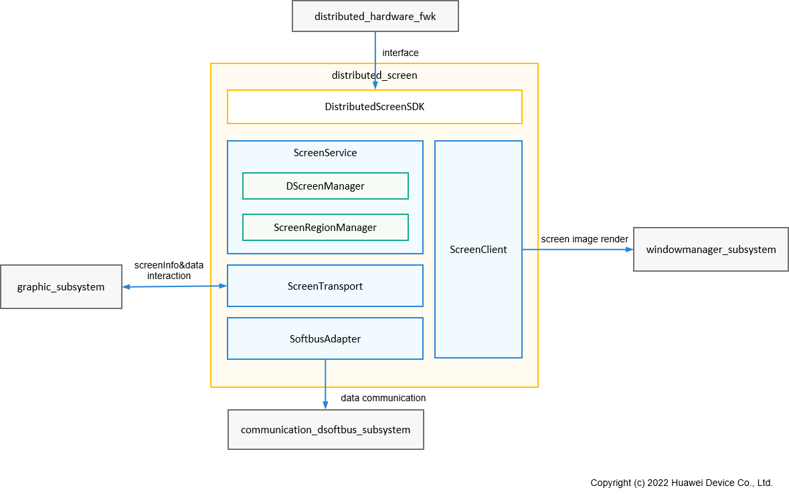

# **Distributed screen components**

## **Introduction**

The system architecture is shown in the figure below:



**ScreenRegionManager** : Manages the status of the display region mapped by the master terminal on the screen of the controlled terminal, including specifying the display for the display region, setting the width and height of the display region, decoding type and other parameters.

**Distributed ScreenManager** : Manages the parameters and state of the screen on the controlled end, and is responsible for the creation and destruction of objects related to the master end.

**ScreenService** : Distributed screen master SA service and distributed screen controlled SA service, responsible for handling IPC calls of distributed hardware management framework

**SoftbusAdapter** : connects to the soft bus transmission interface, provides unified call interface encapsulation for screen images, input events, etc, and realizes the transmission and interaction of stream data and byte data between devices.

**ScreenTransport** : Distributed screen transmission module, screen image data encoding, decoding, sending, receiving.

**ScreenClient** : ScreenClient client for displaying screen image data projected from other devices on the device.

## **Directory**

```
/foundation/distributedhardware/distributedscreen 
├── common                                  # Distributed screen common data definitions, including constants, error codes, logs, tools, and so on
├── interface                               # Distributed screen SDK, including master side and controlled side service call interface调用接口 
├── sa_profile                              # SA configuration information for distributed screens
├── services                                # Distributed screen main control terminal and controlled terminal function main business implementation 
│   └── common                              # Distributed screen function Main control end, controlled end shared function realization
│       ├── databuffer                      # Screen data store definition 
│       └── screen_channel                  # Screen data transfer channel interface definition 
│   └── screenclient                        # Distributed screen agent client implementation
│   └── screenservice                       # Distributed screen main function realization 
│       └── sinkservice                     # Distributed screen controlled end service function realization
│           ├── dscreenservice              # Distributed screen controller SA 
│           └── screenregionmgr             # Distributed screen manages the display area of the controller 
│       └── sourceservice                   # Distributed screen master terminal service function realization
│           ├── dscreenmgr                  # Distributed screen Main control terminal screen management
│           └── dscreenservice              # Distributed screen master SA 
│       └── screentransport                 # Distributed screen transfer components 
│           ├── screendatachannel           # Screen data transfer channel for data transfer between transport components and codecs 
│           ├── screensinkprocessor         # Distributed screen controlled data processing module, including decoding, etc 
│           ├── screensinktrans             # Distributed screen data transmission component at the controlled end, including data transmission channel and data processing module Processor 
│           ├── screensourceprocessor       # Distributed screen master terminal data processing module, including coding, etc 
│           └── screensourcetrans           # Distributed screen main control terminal data transmission components, including data transmission channel and data processing module Processor 
│       └── softbusadapter                  # Soft bus interface adapter for screen transmission, touch event transmission to provide a unified transmission interface 
└── screenhandler                           # The distributed hardware information report and device status change notification are loaded by the distributed hardware management framework
```

## **constraint**
**language restrictions** : C++ 

**Networking environment** : Ensure that the devices are on the same LAN.

**Operating system Restrictions** : OpenHarmony operating system.

## **indicates**
### **The concept that**

Master terminal (source) : The control terminal, by invoking the distributed screen capability, uses the screen of the controlled terminal to display the screen content of the master terminal device.

Controlled end (sink) : the controlled end receives the control of the main control end through the distributed screen and receives and displays the screen content of the main control end in the local interconnection window.

### **Interface specification**
The distributed screen implements the interface provided by the distributed hardware management framework. The distributed hardware management framework uniformly calls the interface to create and register the virtual screen hardware.

### **Scenario Description**
After device networking authentication, the main control device can specify the screen of the controlled device to Display the content drawn by Display.


### **Process description**
#### **1. Start the device**
The system pulls up the SA service of the distributed screen, initializes the Source side, and initializes related modules.

#### **2. Device networking online**
After the device goes online, the distributed hardware management framework synchronizes the screen hardware information of the online device and enables it. After the device is enabled successfully, a virtual screen is added to the system and notified to the window subsystem, which manages the local screen and distributed screen in a unified manner. The northbound application can query the distributed screen through the interface provided by the window subsystem and use the distributed screen according to the interface provided by the window subsystem.

#### **3. Screen data flow**
(1) The graphics subsystem of the master terminal saves the screen data to be sent in the input Surface created by the encoder.

(2) The master encoder encodes the input data and returns the encoding result to the transmission component ScreenSourceTrans.

(3) ScreenSourcetrans, the transmission component of the master end, sends the encoded data to the SoftBusAdapter through the transmission channel ScreenDatachannel, and sends it to the controlled end device through the softbus subsystem.

(4) After receiving the screendata, the softbus subsystem of the controlled device returns it to the ScreenDatachannel through the SoftBusAdapter.

(5) The controlled transmission channel ScreenDatachannel will transfer the screendata obtained to the decoder for decoding.

(6) The decoder decodes the screen data and saves the decoded data to the Surface of the decoder set by the display window of the controlled end agent. Finally, the screen will be displayed by the window.

#### **4. Device offline**
After the device is offline, the distributed hardware management framework disables the screen hardware of the offline device, removes the corresponding virtual screen locally, and notifies the window subsystem. In this case, the distributed screen of the offline device is unavailable.

## **refers to warehouse**

**Distributed hardware subsystem:**

Equipment management
[device_manager](https://gitee.com/openharmony/device_manager)

A step-by-step hardware management framework
[distributed_hardware_fwk](https://gitee.com/openharmony/distributed_hardware_fwk)

Distributed camera
[distributed_camera](https://gitee.com/openharmony/distributed_camera)

**Distributed screen
[distributed_screen](https://gitee.com/openharmony/distributed_screen)**